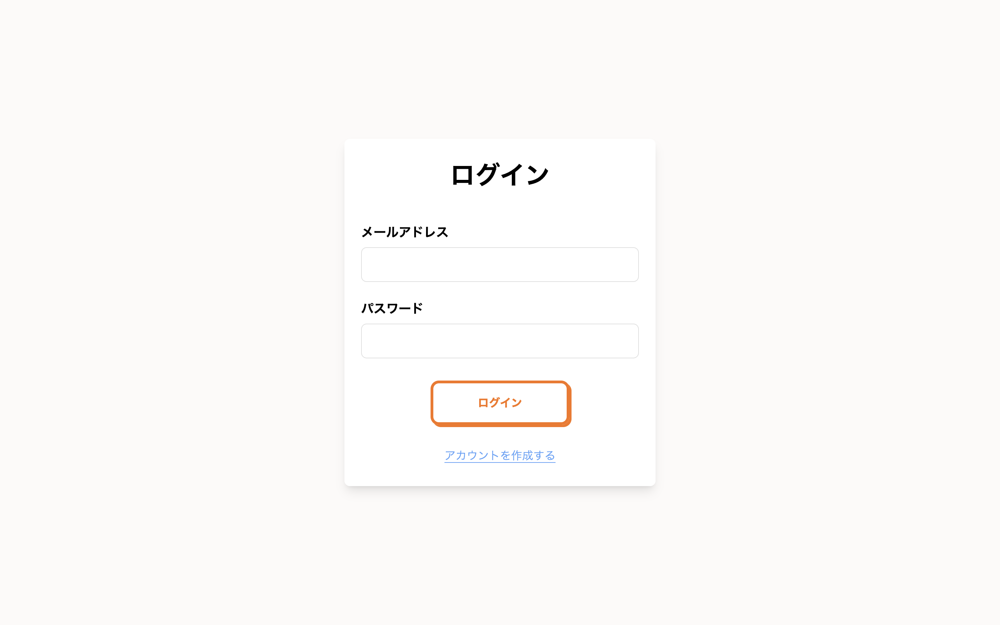
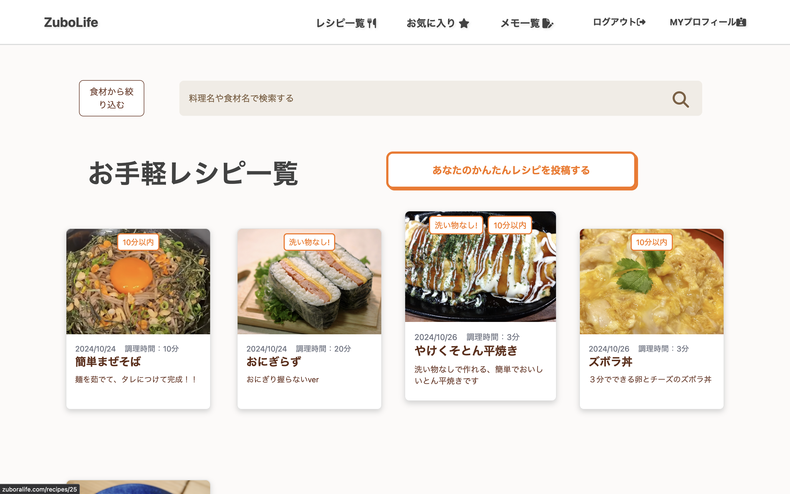
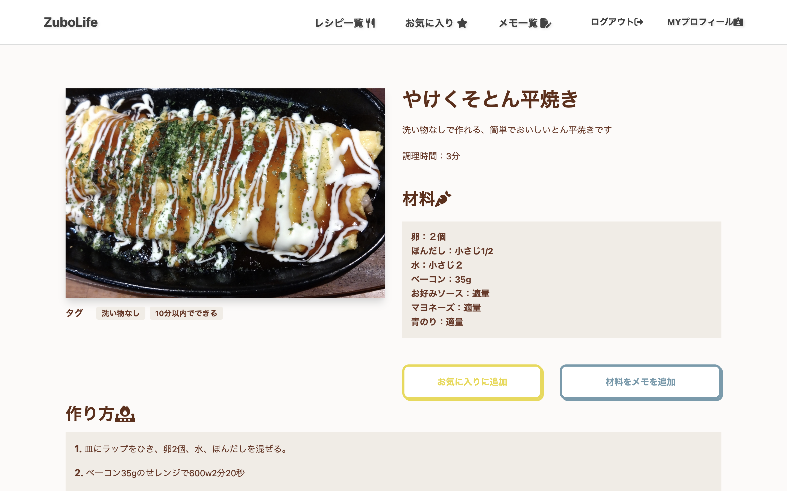
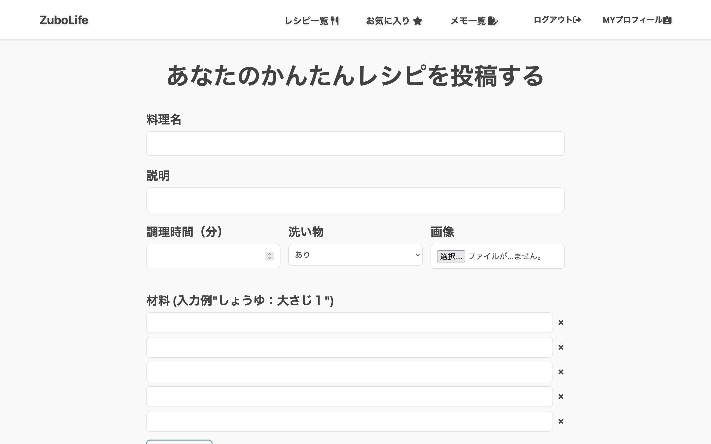
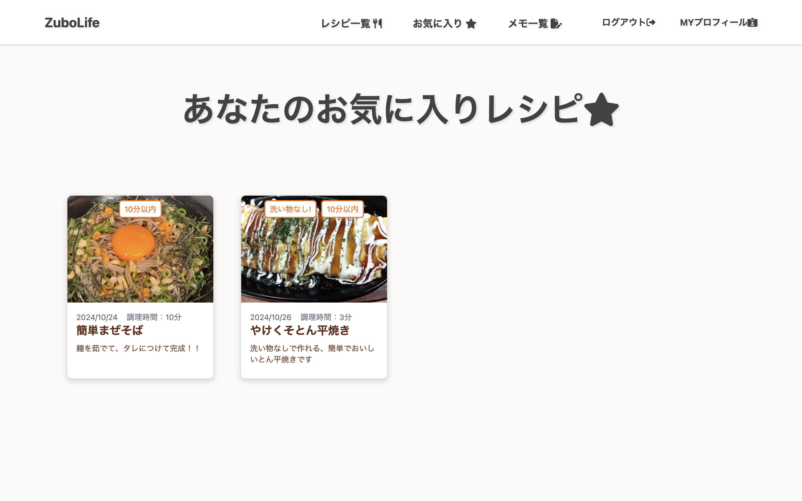
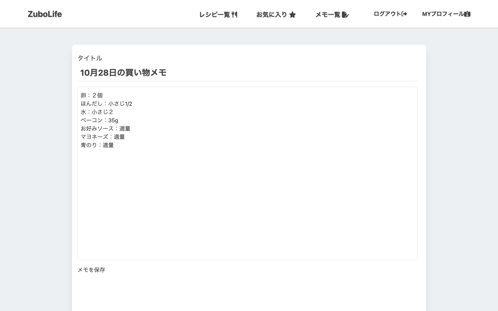
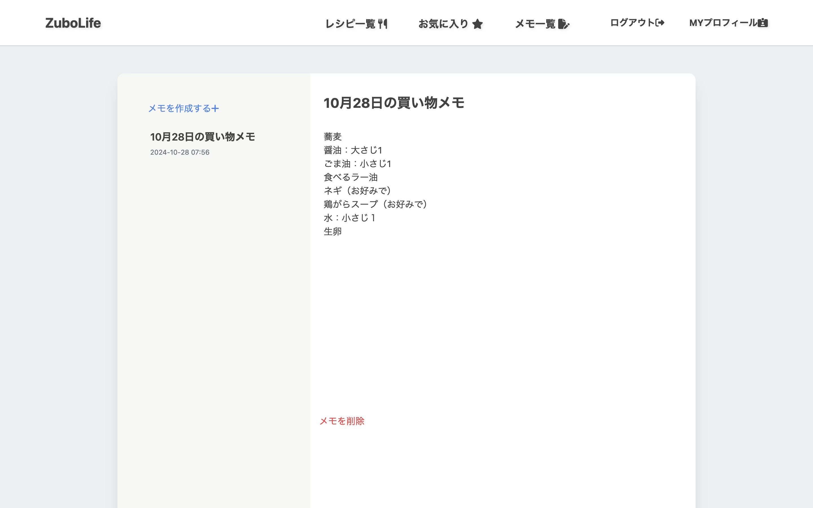
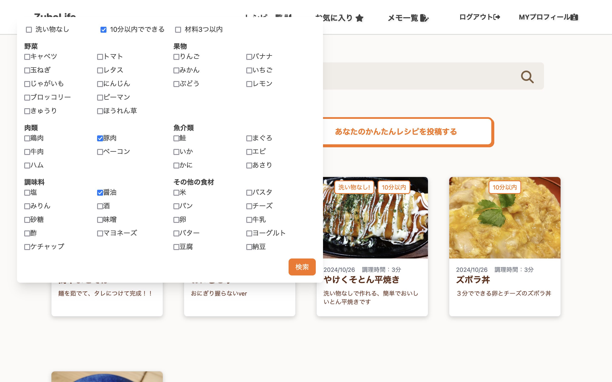

# ZuboLife

ZuboLifeは、一人暮らしの人に向けた、ズボラな生活をサポートするためのWebアプリケーションです。

**URL**
- http://zuboralife.com/

### サービスの内容
一人暮らしの人々が日常生活を効率的に管理できるよう、レシピ投稿、スケジュール管理、家計簿機能を提供し、生活全般をサポートします。

### アプリのターゲット
一人暮らしで、家事や生活管理に手間をかけずに済ませたいと考えている20〜30代の忙しい社会人や学生を想定しています。

### アプリが解決する課題
毎日の料理といった生活の基盤を一つのアプリで手軽に管理でき、節約や効率化を促進します。

### 開発の動機
自分自身も一人暮らしで生活管理に苦労しており、同じ悩みを持つ人々に役立つアプリを作りたいという思いから始まりました。

### 工夫したことやこだわったこと
ターゲット層に合うような直感的で使いやすいインターフェースや、一人暮らしの生活に本当に必要な機能のみに絞り、使いやすさを追求しました。

### 苦労したこと
自分がこのアプリを使用する際に、億劫にならず、面倒に感じる手順がないようにするため、UIをデザインする際に特に気を配りました。

## 使用技術 (Technologies Used)

- **Docker**：アプリケーションのコンテナ化および依存関係の管理
- **Docker Compose**：複数コンテナのオーケストレーション（Nginx、PHP、MySQL、Redisなど）
- **PHP 8.3**：アプリケーションロジックの実装言語
- **Laravel**：PHPフレームワーク、APIとデータベース処理のためのフレームワーク
- **Nginx**：ウェブサーバおよびリバースプロキシ
- **MySQL**：データベース
- **Redis**：キャッシュやセッション管理のインメモリデータストア
- **Tailwind CSS**：UIのスタイリング
- **JavaScript**：クライアントサイドの操作とライブラリ管理
- **Google Font API & Bootstrap Icons**：フォントとアイコン
- **AWS (EC2)**：EC2でのアプリケーションホスティング

## 機能一覧 (Features)

| 機能                         | 説明                                                                                                    | デモ                                                                                           |
|------------------------------|---------------------------------------------------------------------------------------------------------|-----------------------------------------------------------------------------------------------|
| **ユーザー認証機能**         | ユーザー登録、ログイン、ログアウト機能。ゲストユーザーも閲覧可能だが、投稿やお気に入り機能はログインが必要 |                   |
| **レシピ一覧表示**           | ホーム画面にユーザー投稿のレシピを一覧表示。各レシピには画像、名前、説明が表示                         |                            |
| **レシピ詳細表示**           | レシピを選択すると詳細画面を表示。詳細には画像、名前、説明、材料、作り方、参考URLを含む               |                        |
| **レシピ投稿**               | ユーザーが新しいレシピを投稿可能。画像、名前、説明、材料、作り方を入力できるフォームを提供           |                            |
| **レシピお気に入り機能**     | レシピをお気に入り登録してリストに保存。お気に入り登録したレシピの一覧表示                           |                              |
| **買い物メモ作成機能**       | 材料を買い物メモに追加可能。メモには材料リストや自由に追加できるメモ欄が含まれる                     |                                  |
| **買い物メモの管理**         | 作成した買い物メモをリストで表示。メモの編集、削除が可能                                             |                            |
| **レシピ検索・フィルタリング**| 材料を基にレシピを検索・フィルタリング。複数の材料やタグでの絞り込みが可能                          |                        |
| **タグ機能**                 | レシピに「10分以内にできる」「材料3つ以内」などのタグを追加。簡単で素早く作れるレシピが検索可能     |                |

---

このアプリケーションを通して、料理レシピの管理・共有が効率化され、ユーザーが簡単にレシピを投稿・閲覧・保存できる環境を提供します。

## アプリの今後

ZuboLifeは本来、全ての一人暮らしの方々の生活を支えるアプリを目指していました。しかし、現段階ではレシピを投稿する機能だけに留まっています。将来的にはこの機能をアプリの一つとして,ユーザーの日常生活を総合的にサポートするプラットフォームへと成長させていきます。具体的には、以下の機能を考えています。

### スケジュール管理機能

一人暮らしの方々が日々の家事を簡単に管理できるカレンダー機能を提供します。効率的な時間の使い方をサポートします。

- **カレンダー表示**: 直感的なカレンダーインターフェースで家事の予定を確認・追加・編集できます。
- **週ごとの家事設定**: 毎週何曜日にどの家事を行うかを設定し、カレンダーを同期させ直感的に予定を把握できます。

### データ分析とパーソナライズ

ユーザーの利用データを分析し、個々のニーズに合わせたレシピ提案や節約アドバイスを提供します。これにより、ユーザー一人ひとりに最適なサポートを実現します。

- **レシピ提案**: 過去の閲覧履歴やお気に入りに基づいて、新しいレシピを提案します。
- **節約アドバイス**: 支出データを分析し、効果的な節約方法をアドバイスします。
- **カスタマイズ通知**: ユーザーの生活パターンに合わせたリマインダーや通知をカスタマイズします。

ZuboLifeは、初期のレシピ投稿機能を基盤に、スケジュール管理や家計簿機能などの追加機能を通じて、一人暮らしの方々の生活をより豊かにサポートすることを目指しています。将来的には、ユーザーのニーズに応じた多様な機能を追加し、サービスへと成長させていきます。常に改善を重ね、ユーザーにとって使いやすく、価値のあるアプリを提供していく所存です。
**ここまで読んでいただきありがとうございます。**
